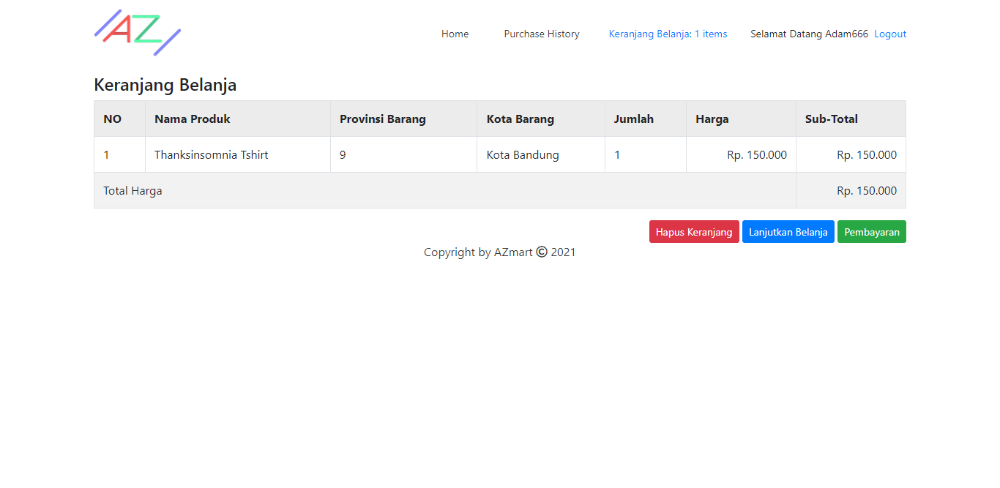
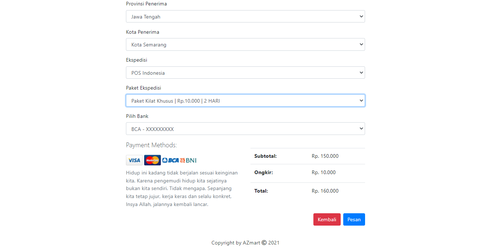
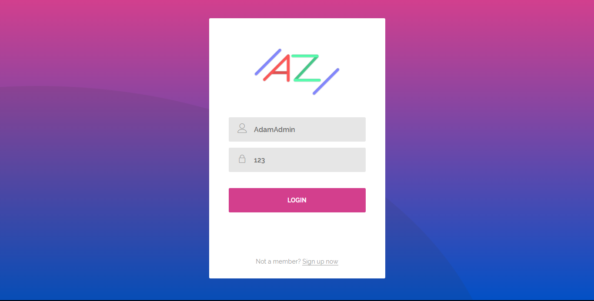
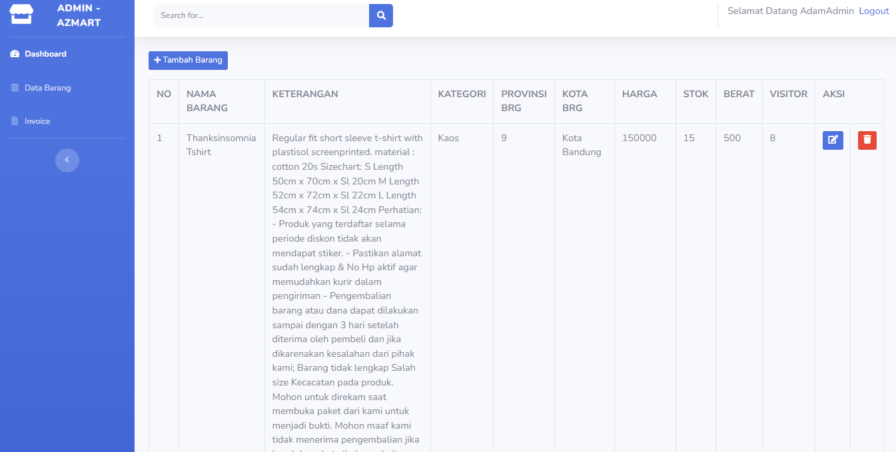

# AZMart
AZMart Website (Full)

### About AZMart
AZMart Website merupakan salah satu project full stack saya untuk membantu klien saya membuat website e-commerce yang sederhana. Mulai dari pemesanan hingga pembayaran. Untuk pembayaran digunaan API dari RajaOngkir untuk memudahkan dalam transaksi pengiriman barang. Terdapat 2 jenis role mode yaitu admin dan customer.

### Berikut Gambaran dari Halaman Customer

### Berikut Gambaran dari Halaman Keranjang
Dilengkapi dengan fitur keranjang untuk memudahkan customer menyimpan barang yang ingin dibeli.

### Berikut Gambaran dari Halaman Pengiriman
Dilengkapi dengan fitur Address and Shipping dengan memanfaatkan API dari RajaOngkir untuk menentukan ongkir dari masing-masing item yang dibeli.

### Berikut Gambaran dari Halaman Login
Dilengkapi dengan fitur Login untuk authentication user.

### Berikut Gambaran dari Halaman Admin
Dilengkapi dengan fitur Admin untuk melakukan sistem CRUD (Create, Read, Update, Delete) pada Halaman Customer.

